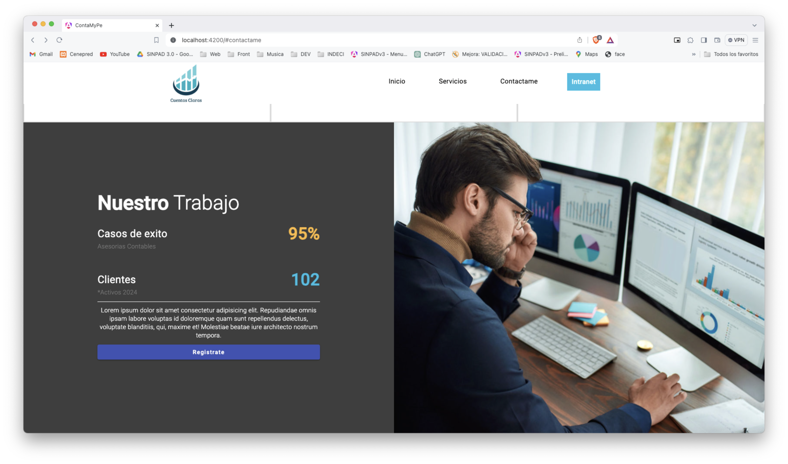
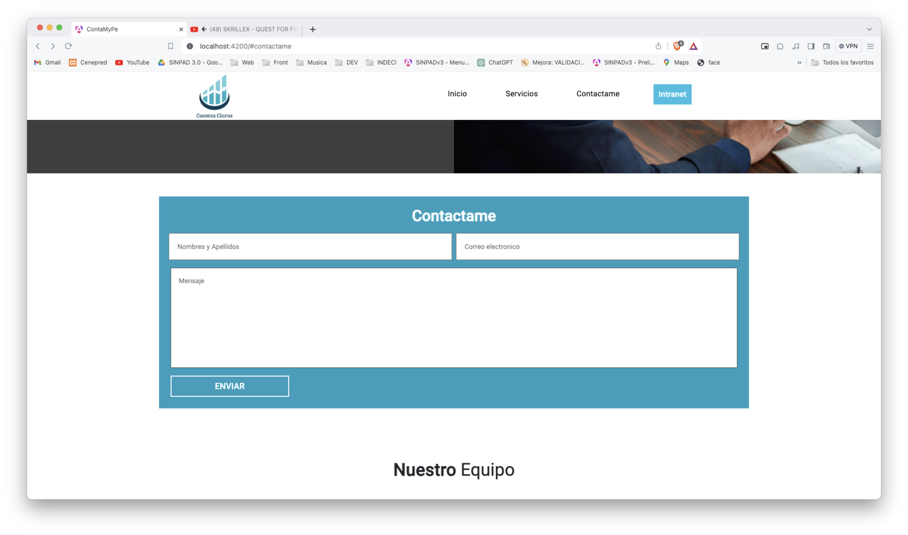
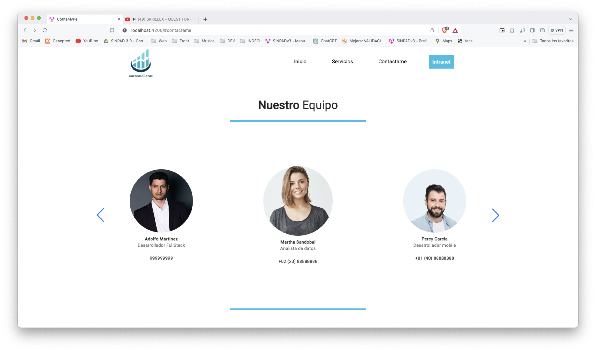
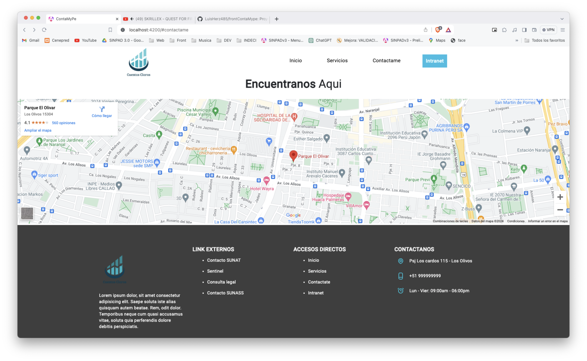

## Requerimientos 
1. Instalar [Node 18.16.0](https://nodejs.org/es/download).  
2. Instalar [NPM v9](https://docs.npmjs.com/cli/v9/commands/npm-install?v=true). 
3. Instalar [Angular Cli 17.1.0](https://angular.io/guide/setup-local).   
    - Realizar la instalacion con la terminal con el comando `npm install -g @angular/cli@17.1.0`
4. Instalar [Visual Studio Code](https://code.visualstudio.com/)
5. Intalar extensiones en VS-CODE:
    1. [Angular Language Service](https://marketplace.visualstudio.com/items?itemName=Angular.ng-template) (obligatorio).
    2. [ESLint](https://marketplace.visualstudio.com/items?itemName=dbaeumer.vscode-eslint) (obligatorio).
    3. [IntelliSense for CSS class names in HTML](https://marketplace.visualstudio.com/items?itemName=Zignd.html-css-class-completion) (obligatorio).
    4. [JavaScript (ES6) code snippets](https://marketplace.visualstudio.com/items?itemName=xabikos.JavaScriptSnippets) (obligatorio).
    5. [Path Intellisense](https://marketplace.visualstudio.com/items?itemName=christian-kohler.path-intellisense) (obligatorio).
    6. [Prettier](https://marketplace.visualstudio.com/items?itemName=esbenp.prettier-vscode) (obligatorio).
    7. [GitLab Workflow](https://marketplace.visualstudio.com/items?itemName=GitLab.gitlab-workflow) (obligatorio).
    8. [Postman](https://marketplace.visualstudio.com/items?itemName=Postman.postman-for-vscode) (obligatorio).
    9. [One Dark Pro](https://marketplace.visualstudio.com/items?itemName=zhuangtongfa.Material-theme) (opcional).
    10. [Material Icon Theme](https://marketplace.visualstudio.com/items?itemName=PKief.material-icon-theme) (opcional).
    11. [Error Lens](https://marketplace.visualstudio.com/items?itemName=usernamehw.errorlens) (obligatorio).

## Configuracion
1. Clonar el repositorio localmente.
2. Realizar el `npm install` para poder instalar las dependencias necesarias (si hay un problema con la versión de las dependencias hacer un `npm install --legacy-peer-deps`).

## Ejecución
Para ejecutar por el terminal solo se tiene que hacer el siguiente comando: `npm start`. Luego de eso se puede abrir un navegador en el puerto http://localhost:4200.

Para poder hacer una ejecución en modo debug usando breakpoints y otras características abre "Run and Debug" en Visual Studio Code. Luego sigue los siguientes pasos:
- Ejecuta "NPM Start" (si ya ejecutaste `npm start` por terminal puedes omitir este paso).
- Ejecuta "Launch Chrome".

Con esos pasos se podrá debuggear en el Angular con Visual Studio Code.

## Proyecto
1. Single Page

    1. Cabecera y slider

    
    Cabecera y slider mantenible con constantes

    2. Nuestros trabajos

    

    3. Contactanos

    
    formulario de contacto basico para la integracion con cualquier servicio emailing

    4. Nuestro equipo

    
    Carrusel del equipo de trabajo con posibilidad a extension de funcionalidad a medida

    5. Ubicanos y footer

    
    Seccion de encuentranos con integracion de google maps y/o leaflet

2. Intranet 
    -- En Construccion --